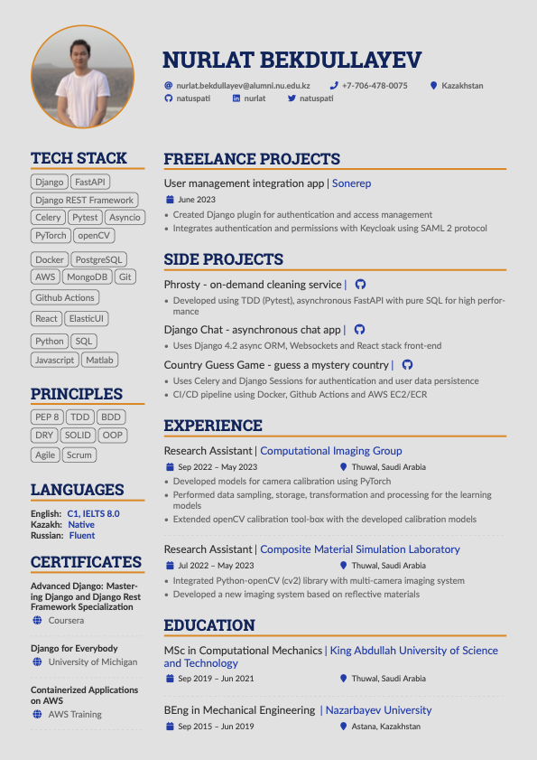

### CV for Python Developer

A single-page, two-column resume.

Custom commands are used to provide consistent formatting.

The five main sections in the resume are projects, experience, education, technical skills and certifications.

### Build using Docker

Build PDF with `XeLatex` to avoid issues with non-standard characters `PdfLatex` struggles with.

```sh
docker build -t latex .
docker run --rm -i -v "$PWD":/data latex xelatex main.tex
```

### Preview



### License

Format is MIT but all the data is owned by Nurlat Bekdullayev.